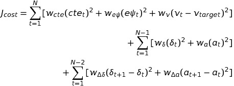

# CarND-MPC
Drive a race car around a track using a MPC (Model Predictive Control). 
The program is written in C++.  This Project is from Udacity's Self-Driving Car Engineer Nanodegree Program.

## Basic Set-up
1. Clone this repo.
2. Install the libraries uWebSockets and Ipopt   
*uWebSockters*: Make sure [uWebSocketIO](https://github.com/uWebSockets/uWebSockets) is installed.  Two install scripts are included for MAC and Linux.  For Windows use [Windows 10 Bash on Ubuntu](https://www.howtogeek.com/249966/how-to-install-and-use-the-linux-bash-shell-on-windows-10/) and following the Linux instructions.  
*Ipopt*: Make sure Ipopt [Ipopt](https://projects.coin-or.org/Ipopt) is installed. The install script istall_ipopt.sh is included along with instructions that can be found in install_Ipopt_CppAD.md.
3. Make a build directory: `mkdir build && cd build`
4. Compile: `cmake .. && make`
5. Run the programs: Run `./mpc`. Open [Term 2 Simulator](https://github.com/udacity/self-driving-car-sim/releases) and run the corresponding page.  

## The Model  

### The Kinematic Model
To drive the race car around the track, we need to specify a kinematic model for the vehicle.  To specify the model, we need to know the state of the car, how to control is movement via actuators and the equations of motions that it follows.
* **The State**:  The state vector contains information about the state of the vehicle.  We track the position (x,y), the orientation (&psi;) and the velocity (v) of the car.  In addition to this, we include L<sub>f</sub> which is a measure of the distance between the front of the car and its center of gravity.  

    state = [x, y, &psi;, v]    

* **The Actuators**: The actuators are what we use to control the vehicle.  The actuators are the steering angle (&delta;) and the throttle (a).  The throttle (a) has a range from [-1,1] where negative values are for breaking and positive values are for acceleration.   

    actuators = [&delta;, a]

* **The Equations of motion**:  The equations of motion indicate how the car moves through time.  The state changes from time t to time t+dt according to the equations:

    x<sub>t+1</sub> = x<sub>t</sub> + v<sub>t</sub>cos(&psi;<sub>t</sub>) * dt   
    y<sub>t+1</sub> = y<sub>t</sub> + v<sub>t</sub>sin(&psi;<sub>t</sub>) * dt  
    &psi;<sub>t+1</sub> = &psi;<sub>t</sub> + (v<sub>t</sub>/L<sub>f</sub>) &delta;<sub>t</sub> * dt  
    v<sub>t+1</sub> = v<sub>t</sub> + a<sub>t</sub> * dt

### The Trajectory
To drive the race car around the track, we need to know the reference (or desired) path.  This is provided to us a set of waypoints.  The reference path can then be inferred by fitting those points with a cubic polynomial.   

**Calculation Frame of Reference:**  The state of the car and the waypoints are given in the map's coordinates.  Before the reference path is fit and the other calculations are run, we transform from the map's frame of reference to the cars frame of reference using a rotation and a translation.  The state of the car in its reference frame is then [x=0,y=0,&psi;=0,v]. 

### The Errors
To determine how far we are off of the desired path, we calculate two errors. 
1. The cross track error (cte).  The cross track error is the difference between the closest point on the desired path and the vehicle's position.  The desired path is given as f(x), where f is the cubic polynomial fit to the waypoints.
2. The orientation error (e&psi;).  The orientation error is the difference between the desired orientation and the current orientation.  The desired orientation is given by the arctangent of the derivative of f(x) or arctan(f<sup>'</sup>(x)).

* These errors change from time t to time t+dt according to the equtions:

    cte<sub>t+1</sub> = (y<sub>t</sub> - f(x<sub>t</sub>)) + v<sub>t</sub> sin(e&psi;<sub>t</sub>) * dt  
    e&psi;<sub>t+1</sub> = (&psi;<sub>t</sub> - arctan(f<sup>'</sup>(x<sub>t</sub>)) + (v<sub>t</sub>/L<sub>f</sub>) &delta;<sub>t</sub> * dt  

### Calculating the optimal steering and throttle 
Given the current state of the vehicle, we need to find the optimal steering and throttle values that will lead to following the reference trajectory. This can be found using optimization. To do this, we step the car ahead in time N steps of duration dt. We compare the cars trajectory with the reference trajectory and minimize the errors to find the optimal throttle a<sub>t</sub> and steering value &delta;<sub>t</sub> at each step. The steering and throttle values from the first step are then used to drive the vehicle.

This cost function that is minimized is


The w's are the weights associated with each term and are adjusted to obtain the desired tracking behavior.

**The weights w:**
The weights for the cost function were set to w<sub>cte</sub>=1 w<sub>e&psi;</sub>=10, w<sub>v</sub>=0.0125, w<sub>&delta;</sub>=1000, w<sub>a</sub>=0.01, w<sub>&Delta;&delta;</sub>=1000 and w<sub>&Delta;a</sub>=0.01. 

**N and dt:"**
The values of N=10 and dt=0.15 were chosen.  This provided a smooth ride around the track where the car cornered well and did not have overshoots on the straightaways after the corners.  Other combinations of N=10,15,20 and dt=0.1,0.15,0.2,0.3 were evaluated. 

**Latency:** In real systems, there is a time delay between when the state of the system is measured and when the new control values are acted on. This latency was given as 100ms. To account for this, we evolve the vehicle's state and errors to where they would be at time t=100ms (the latency) from now and ran the optimization from t=100ms to t=100ms+N*dt. 

## The Race
Enclosed is a video of the car racing around the track.
<> 

## Other Important Dependencies

* cmake >= 3.5
 * All OSes: [click here for installation instructions](https://cmake.org/install/)
* make >= 4.1(mac, linux), 3.81(Windows)
  * Linux: make is installed by default on most Linux distros
  * Mac: [install Xcode command line tools to get make](https://developer.apple.com/xcode/features/)
  * Windows: [Click here for installation instructions](http://gnuwin32.sourceforge.net/packages/make.htm)
* gcc/g++ >= 5.4
  * Linux: gcc / g++ is installed by default on most Linux distros
  * Mac: same deal as make - [install Xcode command line tools]((https://developer.apple.com/xcode/features/)
  * Windows: recommend using [MinGW](http://www.mingw.org/)
* [uWebSockets](https://github.com/uWebSockets/uWebSockets)
  * Run either `install-mac.sh` or `install-ubuntu.sh`.
  * If you install from source, checkout to commit `e94b6e1`, i.e.
    ```
    git clone https://github.com/uWebSockets/uWebSockets
    cd uWebSockets
    git checkout e94b6e1
    ```
    Some function signatures have changed in v0.14.x. See [this PR](https://github.com/udacity/CarND-MPC-Project/pull/3) for more details.

* **Ipopt and CppAD:** Please refer to [this document](https://github.com/udacity/CarND-MPC-Project/blob/master/install_Ipopt_CppAD.md) for installation instructions.
* [Eigen](http://eigen.tuxfamily.org/index.php?title=Main_Page). This is already part of the repo so you shouldn't have to worry about it.
* Simulator. You can download these from the [releases tab](https://github.com/udacity/self-driving-car-sim/releases).
* Not a dependency but read the [DATA.md](./DATA.md) for a description of the data sent back from the simulator.
